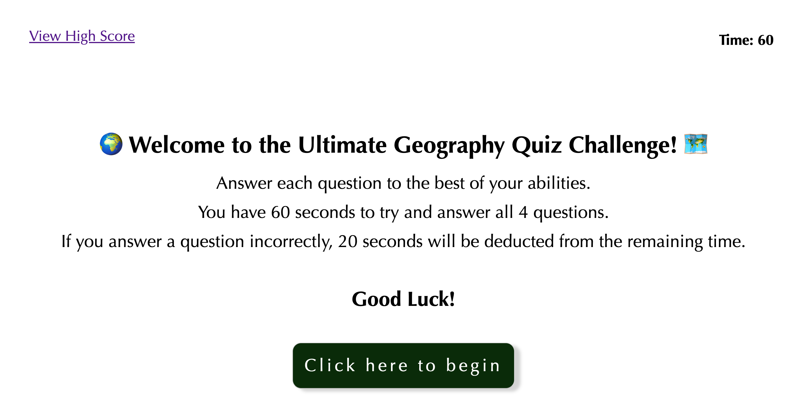

# Homework 4: Code Quiz

## Objectives

Have a functioning quiz that is timed and stores high scores.
Display questions one at a time and provide multiple choice answers.
If the correct answer is chosen, the user gets 10 points.
If the incorrect answer is chosen, the timer gets deducted by 20 seconds.
At the end of the quiz, the final score is displayed and the user can enter their initials to go on the scoreboard.

## Screenshot

## Link to Deployed Page

[Here is a link to the deployed page.](https://erikaosterbur.github.io/code-quiz/)

